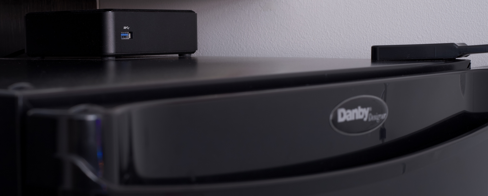
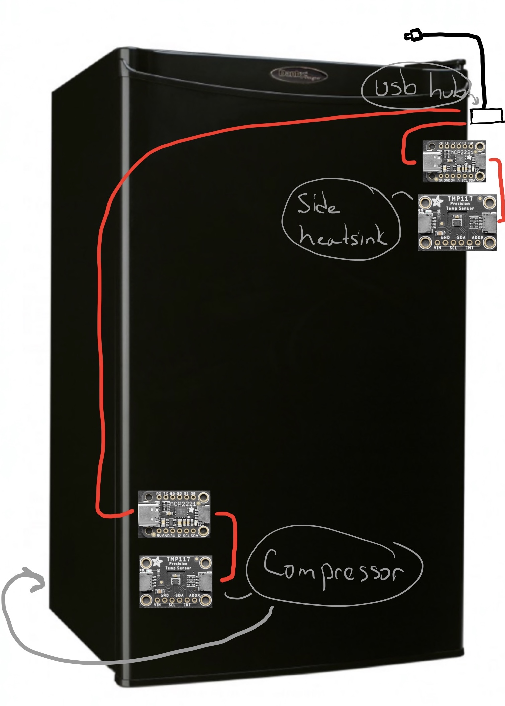
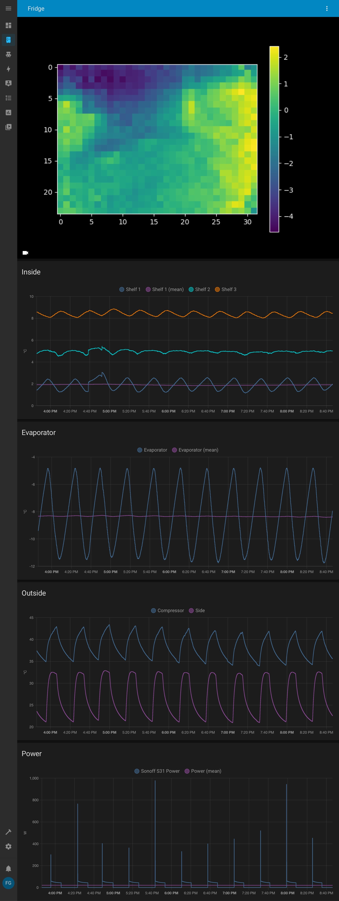

# Smart Beer Fridge

## The general idea

The goal of this project is to make a custom control for a [DCR032A2BDD](https://www.danby.com/products/compact-refrigerators/dcr032a2bdd/) Danby mini fridge
hoping to introduce a couple different modes to save power/reduce noise/reduce strain in
idle periods and precisely cool when we need it.

I'd also like to get that "sub-zero" tap experience at home from times to times.

This idea came from this quote from the manufacturer's FAQ:

> The temperature range of Danby’s refrigerators are between 32F-39.2F/0C – 4C.
> ...
> Our refrigerators are capable of maintaining a wider range than the specified temperature
> ...

## Hardware Upgrade

| Inside Sensors | Outside Sensors |
|---|---|
|  |  |

## Interface

All sensors are sent to an Home Assistant instance through MQTT.

## Control

The original fridge thermostat has been shorted and replaced by a Sonoff S31 relay.

The fridge control is done in two stages.

- The base stage ensures that the fridge doesn't overrun the hardware capabilities
e.g. compressor overheat.
- On top of that, a software Thermostat is executed.

## Failsafe

The Sonoff S31 relay has been reflashed with ESPHome so that a failsafe can be
implemented.

Basically the control software sends a keepalive ping to the relay through MQTT
on each control loop. If the relay stops receiving keepalives for 10 minutes,
something is wrong and so we failsafe to 10 minutes ON/50 minutes OFF.

This ensures that the fridge won't freeze itself to death.

## IR view

This is what the infrared sensor sees with a room temp can moved from left to
right jumping from one row to the next.

