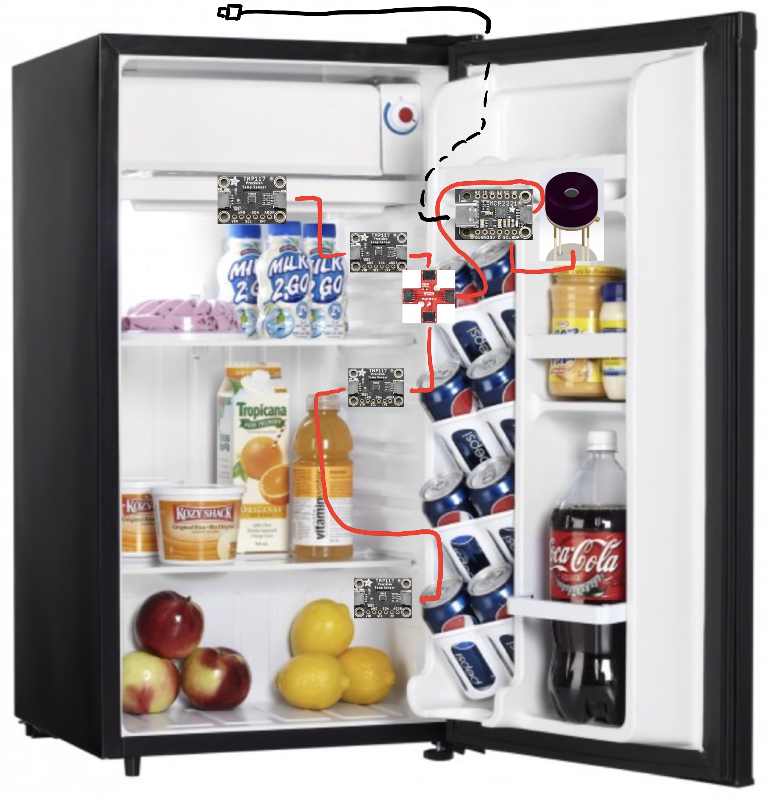

# Smart Beer Fridge

## The general idea

We all like cold beer and one way to reach that target is to acquire a dedicated
fridge for that beverage.

However how cold can it get?

According to the FAQ of my [DCR032A2BDD](https://www.danby.com/products/compact-refrigerators/dcr032a2bdd/)
unit, it can got down to 0°C.

I actually have good memories of the "sub-zero" tap we had at school and I think
even still beer could accept -1°C, even maybe -2°C.

But wait... What did they say?

> Our refrigerators are capable of maintaining a wider range than the specified temperature

I guess they mean if you make your own custom control.

Lets give this a try.

## Step 1 - Install sensors

### Inside

I went with 1 `MLX90640` infrared thermal sensor and 4 `TMP117` roughly installed
like so:

### Outside

I installed one more `TMP117` a temperature sensors on the compressor.

I also added a tp-link `HS110` to get power consumption.

## Step 2 - Get the data out

I send all those sensor out to an Home Assistant instance through MQTT.

## Step 3 - Get a sense of how things are working

We don't want to push things too far so fist we need to learn how the fridge is
working when it does the control itself.

I'm specifically interested how low/high the temperature gets at the evaporator,
how often the compressor starts, for how long, and how does it's temperature
behave.

Things of that nature so when I take control I have a sense of what the limits are.

## IR view

This is what the infrared sensor sees with a room temp can moved from left to
right jumping from one row to the next.

